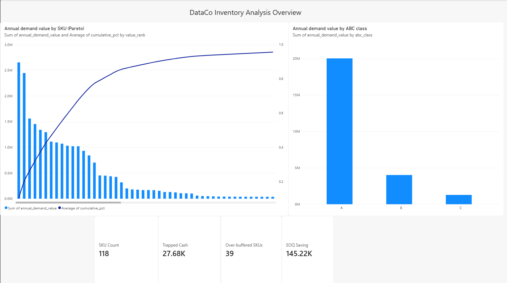
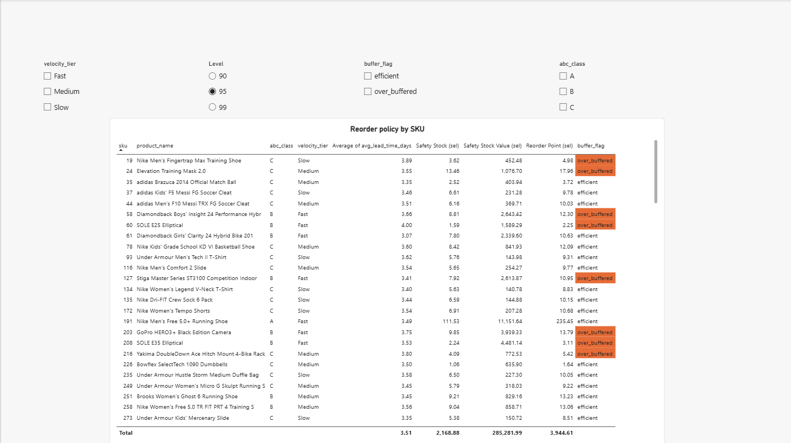
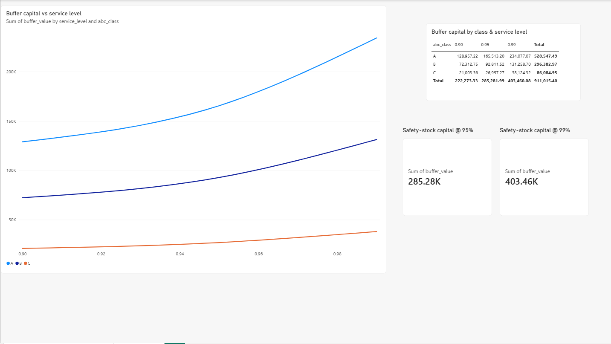

# DataCo Inventory Analytics

By [Gireeshee Pendela](https://github.com/GireesheePendela)

End-to-end inventory analytics on real supply-chain transaction data:
**SQL (DuckDB) → pandas pipeline → Power BI report**.

The pipeline (SQL + Python) turns ≈180k raw order rows into `outputs/sku_metrics.csv`,
one row per SKU. A Power BI report reads that single file — see [Dashboard](#dashboard).

> **v1 scope:** the inventory core only (turnover, ABC, EOQ, safety stock / reorder point,
> mismatch analysis). Logistics and optimization are planned extensions.



## Business question

> Across this catalog, where is working capital trapped in slow-moving inventory,
> and how should reorder policies change to free cash without dropping below a
> 95% service level?

## Data

DataCo Smart Supply Chain (Kaggle, CC0) — `DataCoSupplyChainDataset.csv`,
180,519 order rows, 53 columns, spanning Jan 2015 – Jan 2018 (37 months), 118 distinct
SKUs. The raw file is **not** committed (see `.gitignore`); download it from Kaggle into
`data/`.

**Known limitation:** the dataset has no on-hand inventory column — it is
order/transaction data. Target stock is *prescribed* from demand behaviour
(reorder point + safety stock) rather than read from a stock level. Turnover is
therefore labelled **"implied"**.

## Method

1. **Aggregate (SQL)** — DuckDB rolls ≈180k order rows into a SKU × month demand
   series plus per-SKU lead-time statistics (`src/extract.py`).
2. **Demand profile (pandas)** — each SKU's monthly series is padded with zero
   demand between its first and last sale, then collapsed to mean/σ. SKUs with
   fewer than 6 months of history (33 of 118) are flagged `insufficient_history`.
3. **Four layers** (`src/inventory.py`):
   - **Turnover** — implied inventory turns via an EOQ/2 cycle-stock proxy
   - **ABC** — classification by annual demand value
   - **EOQ** — cost-minimising order quantity vs. a monthly-reorder baseline
   - **Safety stock / reorder point** — at 90/95/99% service, with a
     coefficient-of-variation fallback for the 33 short-history SKUs
4. **Mismatch analysis** — a *buffer-intensity* metric (safety-stock $ per $ of
   annual throughput), independent of ABC value, finds where capital is
   mis-allocated. (Turnover itself is algebraically collinear with ABC value, so
   it can't be used for this comparison — see the notebook for the derivation.)
5. **Report** — the consolidated `outputs/sku_metrics.csv` feeds `report.pbix`.

## Modelling assumptions (not in the data — supplied and documented here)

| Symbol | Meaning | Value | Justification |
|--------|---------|-------|---------------|
| `S` | ordering cost per order | **$75** | staff time to raise a PO, receive the shipment, and match the invoice; industry range ≈$50–100 |
| `H_RATE` | annual holding cost as a fraction of unit price | **25%** | ≈5% cost of capital + ≈15% warehouse/insurance/handling + ≈5% obsolescence & shrinkage (standard 20–30%). Applied to price, not a flat $/unit, so it scales across a $10–$2,000 catalogue. |
| service level | baseline (also tested at 90% / 99%) | 95% (z ≈ 1.65) | industry-standard default |

Defined in one place: `src/inventory.py` (top of file).

## Findings

- **Value is concentrated:** 16 SKUs (14% of the catalogue) are class A —
  79% of annual demand value. 74 SKUs (63%) are class C — just 5% of value.
- **EOQ opportunity:** switching from a monthly-reorder baseline to EOQ cuts
  catalogue-wide ordering + holding cost from ≈$370K to ≈$225K a year
  (**≈$145K, 39%**), with the savings concentrated in class-A SKUs.
- **Buffer capital:** $285K of working capital sits in safety stock at 95%
  service (≈$222K at 90%, ≈$403K at 99% — the last 4 points of service cost
  ≈41% more buffer cash).
- **Trapped cash:** **≈$28K** is tied up in **39 over-buffered class B/C SKUs** —
  safety stock above a median-efficiency benchmark for their throughput. Class B
  is the worst offender (22 of 28 B-SKUs are "Heavy" buffer-intensity despite
  being only 16% of catalogue value).

## Recommendations

1. **Adopt EOQ ordering, starting with class A** — the 16 A-SKUs drive most of
   the ≈$145K/year saving available from right-sizing order quantities.
2. **Move to a class-differentiated service policy** — hold class A at 99%
   service, B/C at 95%. This costs **+$69K** in extra buffer vs. **+$118K** to
   lift the *entire* catalogue to 99% — the same protection where the value is,
   40% cheaper, and nothing drops below the 95% floor.
3. **Attack the ≈$28K trapped in over-buffered class B/C SKUs** through demand
   smoothing and shorter supplier lead times — not by cutting their service
   level. Class B (industrial electronics, first-aid kits, DVDs) is the priority.
4. **Validate the 33 `insufficient_history` SKUs** before acting on their
   reorder points — their demand variability is a class-level estimate
   (coefficient-of-variation fallback), not a measured one.

## Dashboard

`report.pbix` (Power BI Desktop) reads `outputs/sku_metrics.csv` only — no live
connection, no compute inside the report.

- **Overview** — KPI header (trapped cash, EOQ saving, over-buffered SKU count,
  catalogue size), the ABC Pareto curve, and annual value by class.
- **Reorder Policy** — a filterable table (by ABC class, buffer flag, velocity
  tier) of every SKU's safety stock and reorder point, colour-flagged where
  over-buffered, with a 90/95/99% service-level selector.
- **Sensitivity** — buffer capital vs. service level, by ABC class.




## Repo layout

```
data/        raw CSV (gitignored) + data dictionary
notebooks/   analysis.ipynb — the full analysis, all layers
src/         extract.py (SQL aggregation) + inventory.py (the analytical layers)
outputs/     sku_metrics.csv — the ONE finished file the Power BI report reads
             service_level_sensitivity.csv — 90/95/99% buffer comparison
report.pbix  Power BI report built on outputs/sku_metrics.csv
images/      report screenshots used in this README
```

## Run locally

```bash
python -m venv .venv
.venv\Scripts\activate          # Windows
pip install -r requirements.txt -r requirements-dev.txt
# 1. put DataCoSupplyChainDataset.csv in data/
# 2. work through notebooks/analysis.ipynb -> writes outputs/sku_metrics.csv
# 3. open report.pbix in Power BI Desktop
```

## Planned extensions

- **v2 — logistics:** transit time, on-time %, OTIF by carrier/region; feed real
  lead-time variability back into safety stock.
- **v2 — live data:** re-point the extraction step at a self-polled public API.
- **v3 — optimization:** replace closed-form EOQ with a solver once real
  constraints (capacity, budget, multi-echelon) are added.
